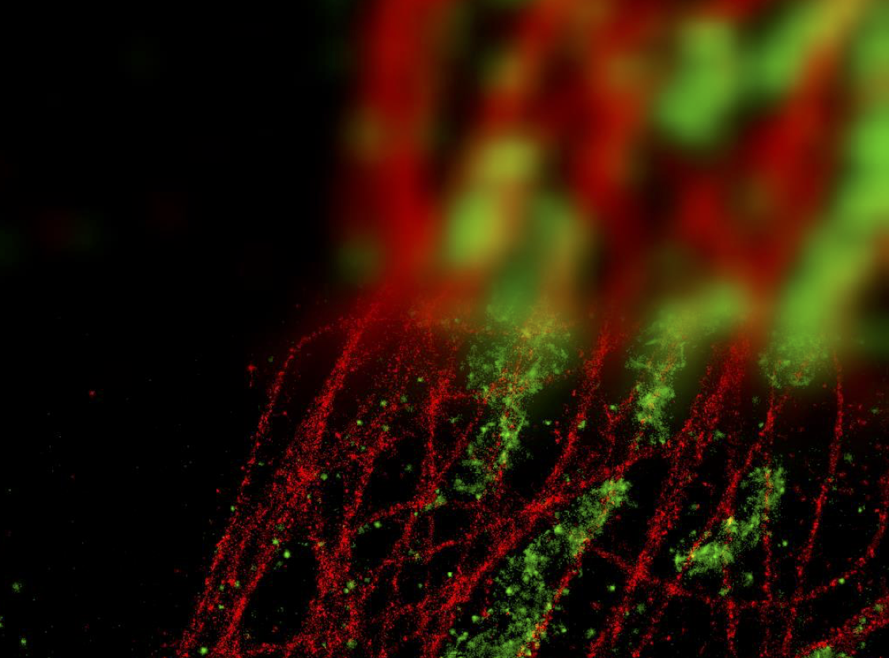

# Super-Resolution by STORM 2015 Workshop

## Presenters
<table>
<tr>
<td><b>Dr Keith Schulze</b> Monash Micro Imaging Email: <a href="mailto:keith.schulze@monash.edu">keith.schulze@monash.edu</a></td>
<td><b>Dr Kirstin Elgass</b> Monash Micro Imaging Hudson Institute of Medical Research Email: <a href="mailto:kirstin.elgass@monash.edu">kirstin.elgass@monash.edu</a></td>
</tr>
<tr>
<td><b>Dr Betty Kouskousis</b> Monash Micro Imaging Burnet Institute Email: <a href="mailto:betty.kouskousis@burnet.edu.au">betty.kouskousis@burnet.edu.au</a></td>
<td><b>Dr Catherine Palmer</b> Monash Micro Imaging Burnet Institute Email: <a href="mailto:catherine.palmer@burnet.edu.au">catherine.palmer@burnet.edu.au</a></td>
</tr>
</table>

## Monash Micro Imaging Team
<table>
<tr>
<td>Ian Harper</td>
<td>Stephen Firth</td><td>Alex Fulcher</td><td>Judy Callaghan</td><td>Jacqueline Mills</td>
</tr>
</table>

## Image Contributors
| Name | Image | Affiliation |
| :--- | :---- | :---- |
| Dilshan Gunasing | Bacterial D-STORM Data | Lithgow Lab   Faculty of Medicine, Nursing and Health Sciences   Monash Unveristy |
| Alex Fulcher | Bacterial D-STORM Data | Monash Micro Imaging & Lithgow Lab   Faculty of Medicine, Nursing and Health Sciences   Monash Unveristy

 

<table>
<tr>
<td align='center' colspan=2 style="padding:0;"></td>
</tr>
<tr style="background-color: #FFF">
<td></td>
<td></td>
</tr>
</table>
