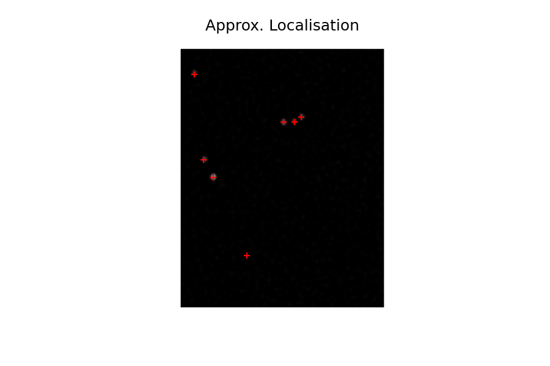
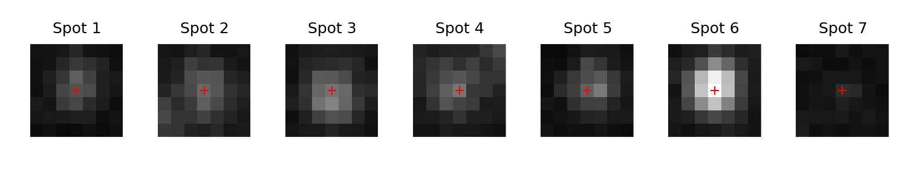
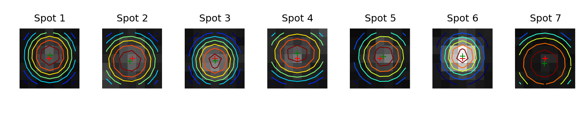

# Super-resolution Image Processing and Reconstruction

---

## low-resolution to SUPER-RESOLUTION

How do we go from low resolution image sequence to a high/super-resolution image?

---

## Spot detection

Threshold

Spots Enhancements:

- Difference of Gaussian (DoG)
- Laplacian of Guassian (LoG)
- Wavelets

---

## Difference of Gaussian (DoG) Demo

---

## DoG

We can get approximate localisation by thresholding

---

## Spots to Localisations

---

### Sub-pixel localisation

---

### Filtering

---

## Post Processing and Quality Control

---

## Image Reconstruction
