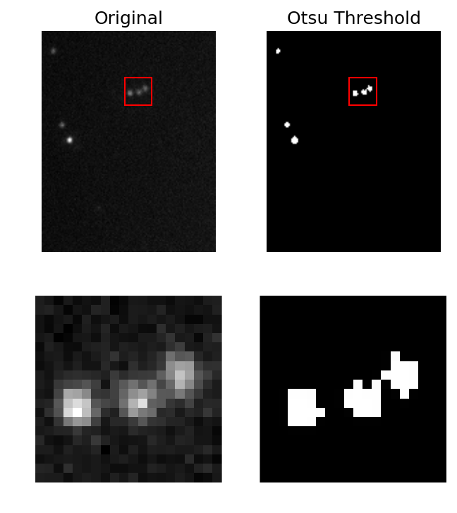
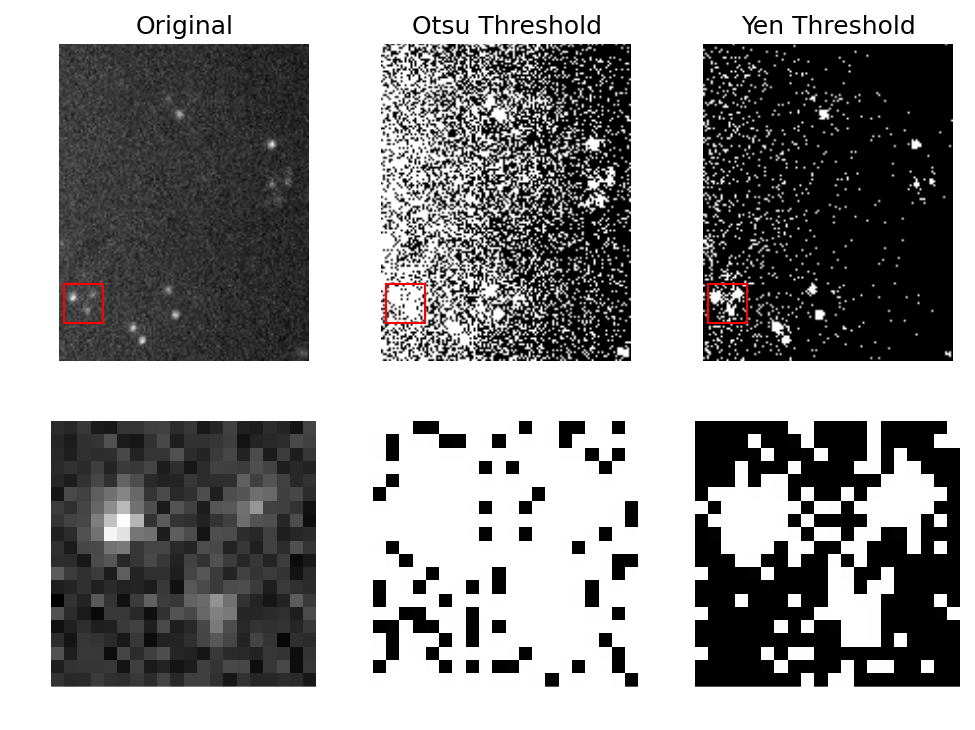
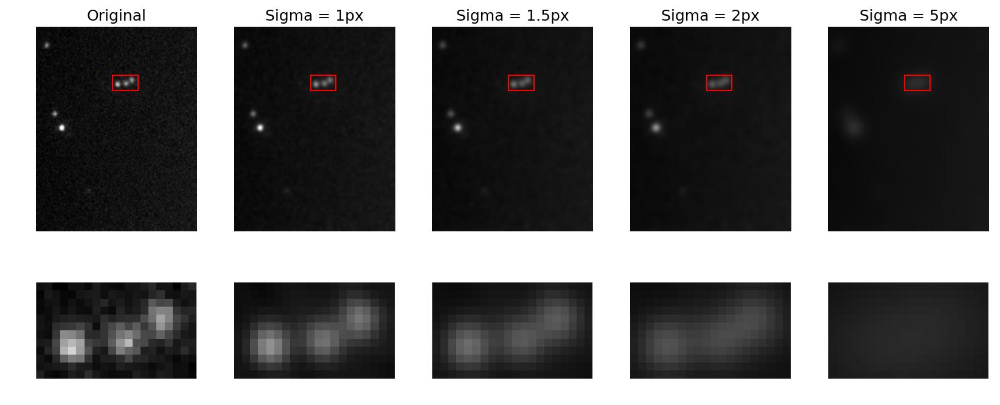
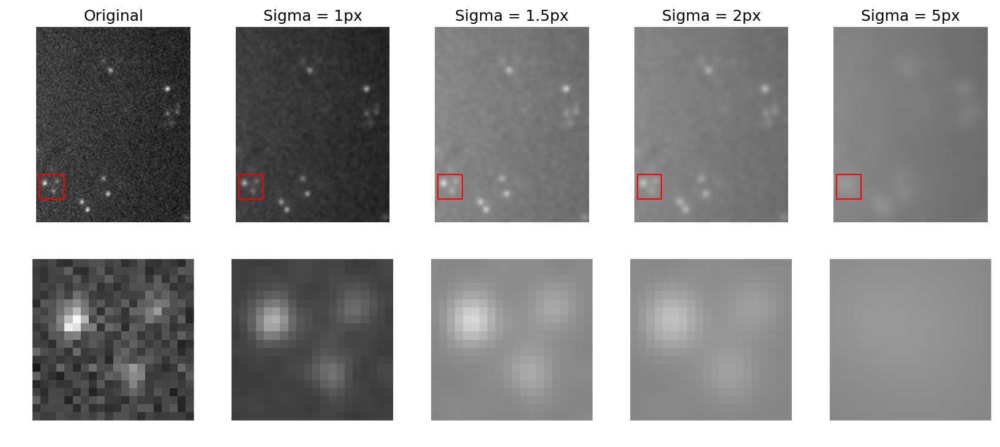
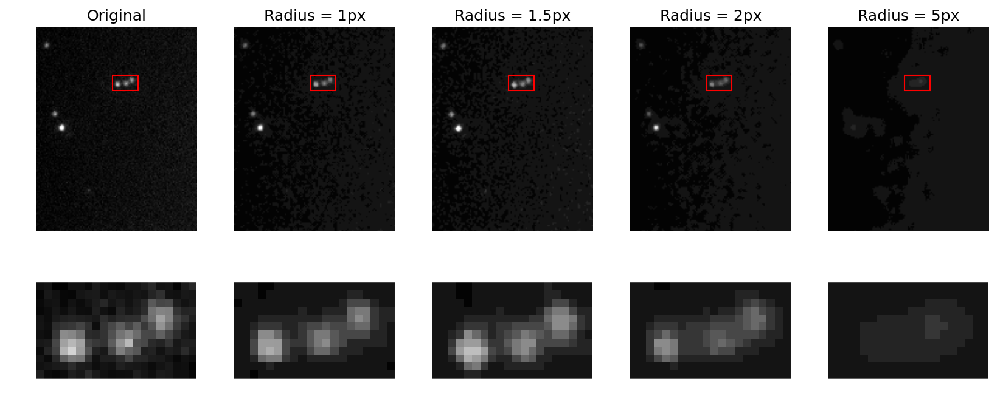
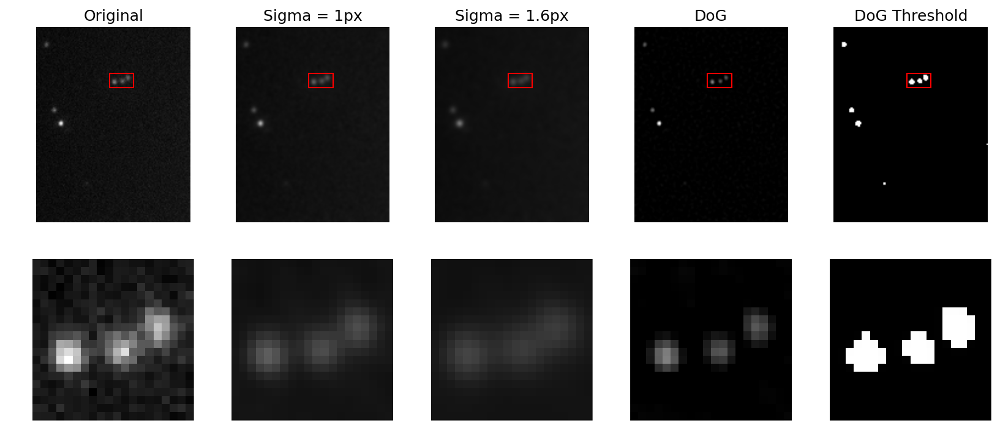
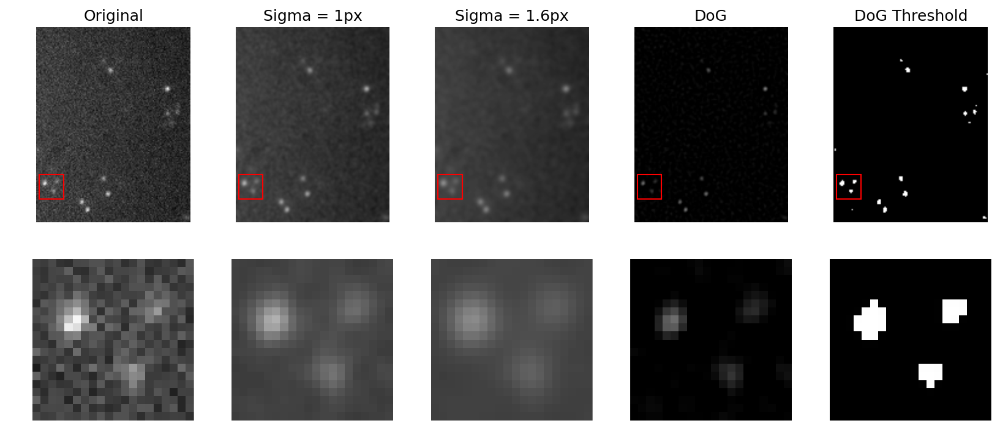

# Spot Detection and Segementation
The first step in process STORM images sit to detect all spots/blink across all time-points. Spot detection is a segmentation problem. It is essentially a process of partitioning an image into foreground (i.e., objects of interest or spots) and the background. Once the image is segmented it is very easy to extract data from each of the individual segmented objects in the image.

Signal-to-noise ratio has a strong influence on segmentation. In a perfect world where there is little noise and lots of signal, simple segmentation methods like thresholding would be sufficient. However, while cameras have improved a lot, the sensitivity required to detect very few photons being emitted from each spots means results in some level of noise.

Even with different thresholding strategies it can be difficult to segment low SNR images accurately. Below is a comparison of thresholding of two images with different SNR:

Note that there is not real substitute for having good images; however, there are some things we can do to work around non-optimal images. There are a number of image processing techniques that have been developed to enhance spots:
* __Simple noise filtering__
    * __Gaussian filter__
    * __Median filter__
    * Anisotropic diffusion
    * Non-local means
* Laplacian of Gaussians (LoG)
* __Difference of Gaussians (DoG)__
* Hessian of Gaussians (HoG)
* Wavelets

Choosing a filtering strategy is usually somewhat of a balancing act. Typically the more complex they are the better the filtering or enhancement will be, but at the cost of being computationally more expensive.

## Filtering

The example filters given here do not specifically enhance spots _per se_; rather they tend to reduce noise in the images, which can be strong contributor to poor segmentation results. Both the filters described as examples here are kernel filters. These typically calculate the value of an output pixel using a function that operates on an input pixel and the pixels in a neighbourhood around the input pixel, the size of which is defined by a width parameter.

### Gaussian filter
Very commonly used filter in image processing. It's very simple and it's fast. Notice that the random fluctuations in pixel intensity around the blink is suppressed with increasing filter strength (i.e., larger sigmas or filter widths). Notice also that the Gaussian filter does not preserve the edges of the spots very well. They get more and more blurred as the filter size increases.

### Median filter
Another commonly used filter in image processing. Not as fast at Gaussian filter because it's not separable; however, it's still reasonably fast. Notice that while noise is similarly suppressed by the median filters, the edge of objects in the image tend to be better preserved.

## Difference of Gaussians
Beyond simple filtering techniques, there are a number of image processing procedures that are specifically designed to enhance certain features (e.g., spots or edges). We will cover only one of these: Difference of Gaussians (DoG). This fancy name may sound complex, but actually DoG is relatively straight forward. The basic idea is that the image is smoothed using 2 gaussian filters (described above) with different filter widths - one smaller and one slightly larger. The smoothed image from the larger of the 2 gaussian filters is simply subtracted from the image smoothed with the smaller gaussian filters:

Notice that the the effect of DoG is that the centre of blob-like objects is enhanced making segmentation easier and more accurate. It does not, however, preserve the overall shape of the object.

## A note on background signal

> Noise != Background (Unspecific) Signal

__NONE__ of these techniques will help to remove 'background' fluorescence deriving from unspecific binding of antibodies. STORM is extremely sensitive and if your antibodies are non-specifically binding, there is nothing that can be done in terms of processing. This should be solved at the bench.
