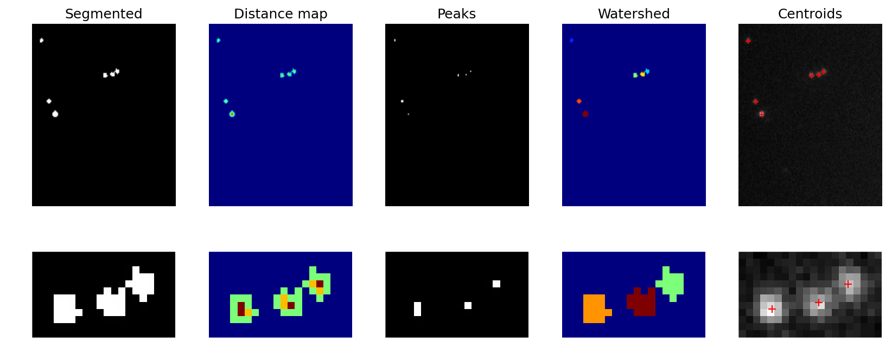

# Spots to localisations
We've manage to isolate the pixels in the images that are part of each spot, but the images are low resolution image (e.g., 256 x 256 pixel or 512 x 512 pixel), so we don't have very precise locations for the actual molecules. Even at 100x magnification, each blink may only encompass a few pixels. While it's possible to determine the brightest pixel amongst the bunch that constitute a blink, the accuracy is very limited at a blinks scale.

Sub-pixel localisation:
* Centroid or Weighted Centroid
* Least-Squares Estimation (LSE; Levenberg–Marquardt) of PSF model
* Maximum Likelihood Estimation (MLE) of PSF model

## Estimating the origin of the blink
### Centroid
One rather crude method for localising spots more precisely is to mathematically calculate the centre of each segmented blob/spot. This is typically referred to as the centroid and it refers to the average position of all the pixels in a spots. To put it another way, if we add the position of all pixels and divide by the number of pixels in a blob, we will get an estimate of the blobs centre.

This is, however, very sensitive to the accuracy of the segmentation. Each spot/blob only has a few pixels in it so if, for one reason or another, an extra pixel (e.g., a higher intensity pixel deriving from noise) is included in the segmented blob, it will significantly shift the centroid of that blob. Furthermore, we not making use of the underlying intensity data and our knowledge of the physical properties of the light.

One extension of this method is to use the centre of mass or weighted centroid of a spot/blob. This incorporates the underlying intensity in the image the weight the centroid towards the most intense part of a spot.

### Fit the intensity data with Gaussian Model
Sub-pixel localisation of spots.

